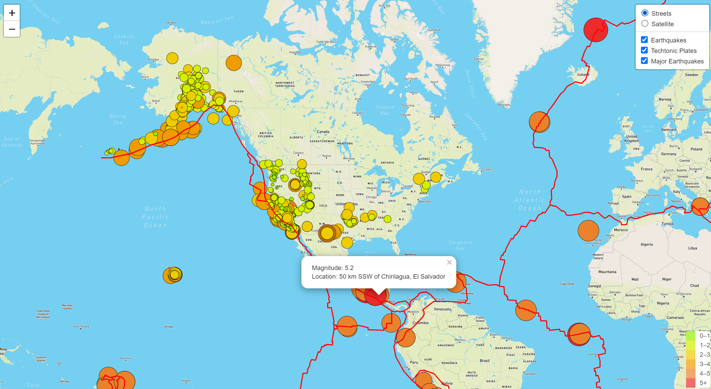
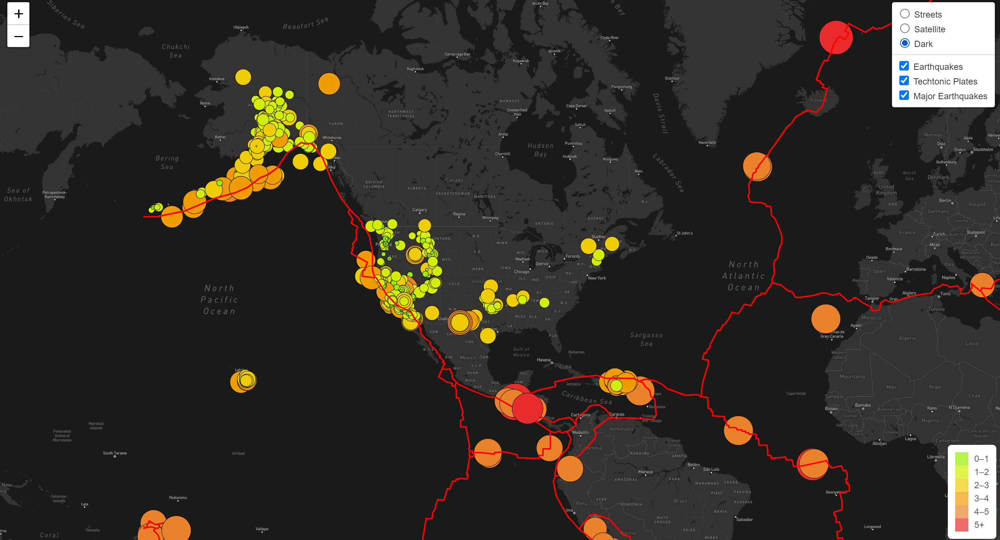

# Mapping_Earthquakes

## Overview of the Project:
The purpose of the project is to gather earthquake GeoJSON data from the USGS API, create and explore interactive maps of earthquakes around the world. The earthquake data is represented on the maps in relation to the tectonic plates’ location on the earth, and according to each event's magnitude.

## Deliverables for the Challenge
- Deliverable 1: Add Tectonic Plate Data
- Deliverable 2: Add Major Earthquake Data
- Deliverable 3: Add an Additional Map

## Results:
### Deliverable 1: Add Tectonic Plate Data

### Deliverable 2: Add Major Earthquake Data

### Deliverable 3: Add an Additional Map

## Resources:
- Data Source: 
  - [Earthquakes GeoJSON](https://earthquake.usgs.gov/earthquakes/feed/v1.0/summary/all_week.geojson)
  - [Earthquakes above 4.5mag GeoJSON](https://earthquake.usgs.gov/earthquakes/feed/v1.0/summary/4.5_week.geojson)
  - [Tectonic Plate GeoJSON](https://raw.githubusercontent.com/fraxen/tectonicplates/master/GeoJSON/PB2002_boundaries.json)

- Software: 
  - HTML/CSS
  - JavaScript
  - Visual Studio Code
  - Leaflet, D3, Mapbox